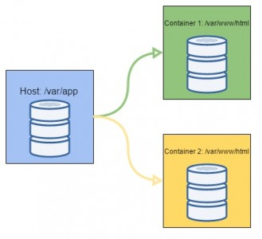

# Treinamento docker

O objetivo desse curso é fornecer informações básicas sobre docker para desenvolvedores.

## Introdução

O Docker é uma plataforma de código aberto para criação de ambientes isolados via container. O funcionamento do docker é possibilitado pelo Linux container — LXC — que nada mais é do que um sistema do kernel do Linux. 

Abaixo a diferença entre os container e máquina virtual (virtual box)

## Containers
Container nada mais é do que um ambiente isolado contido em um servidor que, diferentemente das máquinas virtuais, divide um único host de controle.

### Images
Images Docker são compostas por sistemas de arquivos de camadas que ficam uma sobre as outras. Ela é a nossa base para construção de uma aplicação, ela pode ser desde o base do CentOS como também um CentOS com Apache, PHP e MySQL.

### Volumes

Um volume pode ser apenas o mapeamento de pasta entre o host (seu PC) e container, bem como o mapeamento de uma pasta entre containers.

Veja um exemplo de mapeamento entre host e container

### Portas

O argumento -p permite que você direcione uma porta do host (sua máquina local) para dentro do container

### Alguns Básicos

    Informações do docker
    $docker info

    Listar imagens
    $docker images

    Buscando uma imagens
    $docker search ubuntu

    Buscando uma imagens
    $docker search ubuntu

    Baixando a Imagem
    $docker pull ubuntu

    Criar um container
    $docker run nome_da_imagem

    Criar um container e entrar no Terminal
    O -i significa interatividade e o -t que queremos um link com o Terminal do container.
    $docker run -it ubuntu /bin/bash

    Criar um container com um apelido
    $docker run --name ubuntinho ubuntu

    Listar containers em execução
    $docker ps

    Listar todo os containers
    $docker ps -a

    "Stopa um container"
    $docker stop id_ou_apelido
    
    Remove um cotainer
    $docker rm id_ou_apelido

    Containers auto destrutivos. Com comando --rm, podemos montar containers que se destroem ao sairmos da sessão.
    $docker run -it --rm -p 8080:80 nginx bash

### Exemplos
    
    #Apache e php7.4
    $docker run -d -p 80:80 -v ~/Documents/meu_site/:/var/www/html php:7.4-apache

### Hacks

    Para todos os containners
    $docker stop $(docker ps -a -q)
    
    Remove todos os containers  
    $docker rm $(docker ps -a -q)
    
    Remove todas as imagens
    $docker rmi $(docker images -q)

### TO-DO

Lista de itens a serem incluídos no curso

- [ ] Commit, PULL E PUSH em images
- [ ] Docker Compose
- [ ] Dockerfile
- [ ] DockeSwarm
